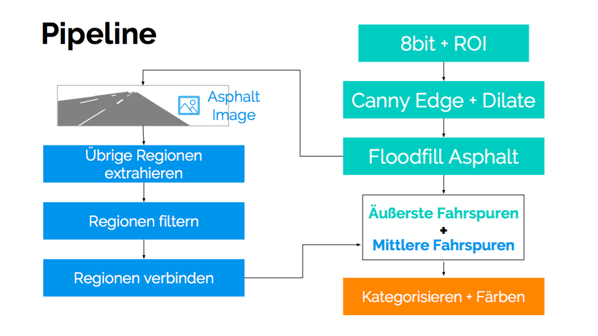

### Extraktion der rechten und linken Egospurmarkierung mittels Line-Growing
#### Aufgabe
Unsere Aufgabe ist die Erkennung sämtlicher relevanter Fahrspurmarkierungen und die gesonderte Hervorhebung der Egospurmarkierungen.

#### Lösungskonzept
Als grundsätzliches Konzept nutzen wir einen Canny-Edge-Detector in Verbindung mit Region-Growing.

Zunächst erzeugen wir eine 8-Bit-Kopie der unteren Hälfte des Originalbildes, auf die wir den Canny-Edge-Detector anwenden. Die Parameter des Edge-Detectors werden später als Programmparameter übergeben.

Das resultierende Bild wird zweimal binär dilatiert, um mögliche Lücken zwischen Linien zu reduzieren. Da der Canny-Edge-Detector einen weißen Rahmen um das Bild erzeugt, wird das Bild an allen Seiten um 12 Pixel beschnitten. Dies verhindert, dass das nachfolgende Füllen des Asphalts das gesamte Bild einfärbt. Durch das Füllen mit schwarzer Farbe entstehen mehrere weiße Regionen. Eine Region enthält Teile des Himmels und der Umgebung, der Rest sind die Fahrspurmarkierungen.

Das entstandene Bild wird kopiert und nun pixelweise iteriert. Wird ein weißer Pixel gefunden, füllt das Plugin diesen und angrenzende Pixel mit schwarz und speichert alle veränderten Pixel als eine Region.

Die erste Region stellt den Himmel und die Umgebung dar, die nicht Teil der Straße ist. Dieser Umstand wird genutzt um die äußeren Spurmarkierungen am linken und rechten Fahrbahnrand zu markieren.

Alle gefundenen Regionen werden nun gefiltert. Die Filterkriterien sind einerseits die Größe und die durchschnittliche Farbe der Regionen. Zu große Regionen (wie zum Beispiel der Himmel) werden entfernt. Aus den verbliebenen Regionen werden die mittleren Farbwerte der Pixel errechnet. Alle weiteren Regionen dürfen diesen Wert (mit gewisser Toleranz) nicht unterschreiten, sonst werden sie auch ignoriert.

Die übrigen Regionen sind nun alle mittlere Fahrbahnmarkierungen, die noch verbunden werden müssen. Dazu startet das Plugin bei einer Region und findet deren mittlere Pixel an den oberen und unteren Enden. Ist der untere Pixel links versetzt, wird links nach weiteren Regionen gesucht, falls der untere Pixel rechts versetzt ist, wird nur rechts gesucht. Andere Fälle werden nicht akzeptiert. Um die nächste Region zu finden, wird die gesamte linke bzw. rechte Seite durchsucht. Befindet sich der erste gefundene Pixel der nächsten Region unterhalb des aktuellen untersten Pixels wird die neue Region als nächste gesetzt und durch eine Linie mit der aktuellen verbunden. Die aktuelle Region wird nun entfernt, um sie nicht erneut finden zu können. Ist keine weitere passende Region verfügbar, wird eine neue Spur mit den verbliebenen Regionen gesucht.

### Nutzerdokumentation
Das Plugin kann über die Kommandozeile mit folgendem Befehl aus dem Verzeichnis der `ij.jar` heraus aufgerufen werden:

	java -jar ij.jar -ijpath Pfad/zu/ImageJ -eval 'run("Detect Lanes",
	 "-i /Absoluter/Pfad/zum/Bild.png")'

Zusätzlich stehen einige Parameter zur Verfügung:
- `-o`: Absoluter Pfad der Ausgabedatei
- `-l`: Mindestgröße (0 .. 1) einer Region, die als Teil der Spurmarkierung erkannt werden soll. (*Standard: 0*)
- `-u`: Maximalgröße (0 .. 1) einer Region, die als Teil der Spurmarkierung erkannt werden soll. (*Standard: 0.1*)
- `-g`: Stärke des Weichzeichnens des Canny Edge Detectors (*Standard: 2.0*)
- `-c`: Untergrenze des Canny Edge Detectors. (*Standard: 2.5*)
- `-C`: Obergrenze des Canny Edge Detectors. (*Standard: 7.5*)
- `-e`: Erweiterter Modus wird übersprungen, fleckige Straßen werden schlechter erkannt
- `-d`: Maximaler Intensitätsunterschied (0 .. 255), die bei der Erkennung von Markierungsteilen toleriert wird. (*Standard: 10*)
- `-v`: Gesprächiger Modus